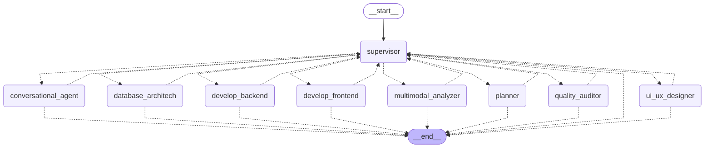

```mermaid
---
config:
  flowchart:
    curve: linear
---
graph TD;
	__start__([<p>__start__</p>]):::first
	supervisor(supervisor)
	conversational_agent(conversational_agent)
	multimodal_analyzer(multimodal_analyzer)
	ui_ux_designer(ui_ux_designer)
	planner(planner)
	develop_backend(develop_backend)
	develop_frontend(develop_frontend)
	quality_auditor(quality_auditor)
	database_architech(database_architech)
	__end__([<p>__end__</p>]):::last
	__start__ --> supervisor;
	conversational_agent -.-> __end__;
	conversational_agent -.-> supervisor;
	database_architech -.-> __end__;
	database_architech -.-> supervisor;
	develop_backend -.-> __end__;
	develop_backend -.-> supervisor;
	develop_frontend -.-> __end__;
	develop_frontend -.-> supervisor;
	multimodal_analyzer -.-> __end__;
	multimodal_analyzer -.-> supervisor;
	planner -.-> __end__;
	planner -.-> supervisor;
	quality_auditor -.-> __end__;
	quality_auditor -.-> supervisor;
	supervisor -.-> __end__;
	supervisor -.-> conversational_agent;
	supervisor -.-> database_architech;
	supervisor -.-> develop_backend;
	supervisor -.-> develop_frontend;
	supervisor -.-> multimodal_analyzer;
	supervisor -.-> planner;
	supervisor -.-> quality_auditor;
	supervisor -.-> ui_ux_designer;
	ui_ux_designer -.-> __end__;
	ui_ux_designer -.-> supervisor;
	classDef default fill:#f2f0ff,line-height:1.2
	classDef first fill-opacity:0
	classDef last fill:#bfb6fc

```